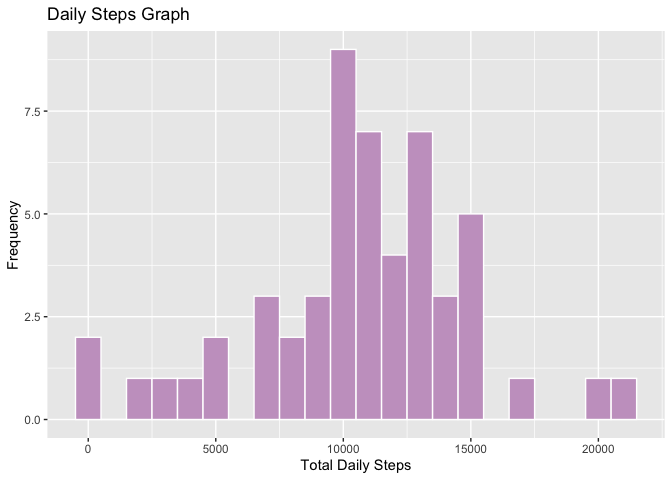
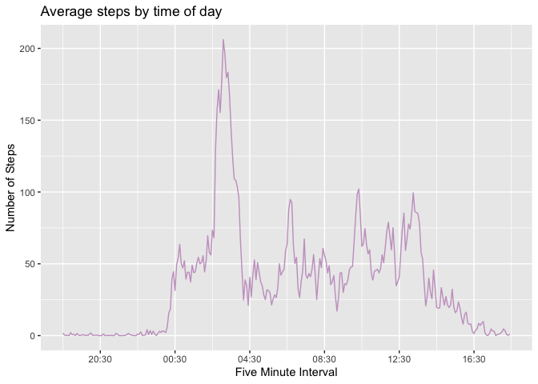
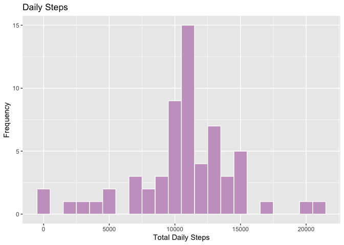
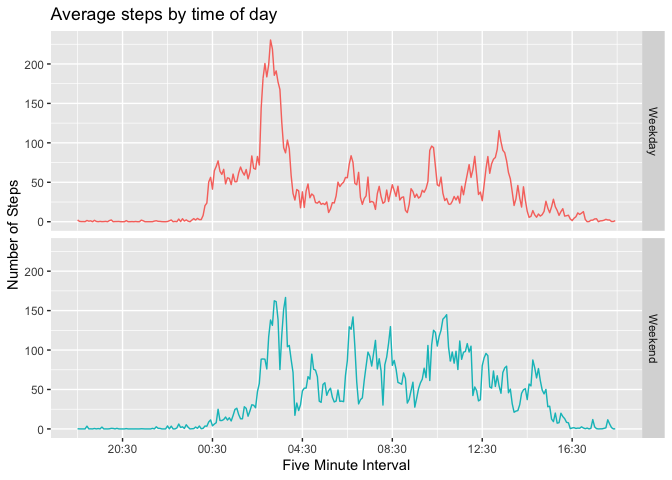

```r
require(ggplot2)
```

```
## Loading required package: ggplot2
```

```r
require(RColorBrewer)
```

```
## Loading required package: RColorBrewer
```

```r
require(dplyr)
```

```
## Loading required package: dplyr
```

```
## 
## Attaching package: 'dplyr'
```

```
## The following objects are masked from 'package:stats':
## 
##     filter, lag
```

```
## The following objects are masked from 'package:base':
## 
##     intersect, setdiff, setequal, union
```

```r
require(ggthemes)
```

```
## Loading required package: ggthemes
```

```r
library(scales)
library(knitr)
```

## Loading and preprocessing the data


```r
# Reading the data 
steps <- read.csv("/Users/riddhi/Desktop/Coursera/RepData_PeerAssessment1/activity.csv", header = TRUE)

# Converting date to Date
steps$date <- as.Date(steps$date)

# Converting the interval to HH:MM format
steps$interval <- 
  format(strptime(formatC(steps$interval, width = 4, format = "d", flag = "0"), format="%H%M"), format = "%H:%M")
```
## What is mean total number of steps taken per day?

```r
## total steps per day calculation

dailySteps <- steps %>%  
          group_by(date) %>%
          summarise(total = sum(steps))


# Histogram of mean steps per day

ggplot(dailySteps, aes(total)) + 
  geom_histogram(binwidth = 1000, fill = "#C8A2C8", col='white') +
  labs(x = "Total Daily Steps", 
       y = "Frequency", 
       title = "Daily Steps Graph")
```

```
## Warning: Removed 8 rows containing non-finite values (stat_bin).
```

<!-- -->

```r
## Mean steps each day

mean(dailySteps$total, na.rm = TRUE)
```

```
## [1] 10766.19
```

```r
## Median of steps (per day)

median(dailySteps$total, na.rm = TRUE)
```

```
## [1] 10765
```

## What is the average daily activity pattern?

```r
intSteps <- steps %>% 
  group_by(interval) %>%
  summarise(mean = mean(steps, na.rm = TRUE))

#Make a time series plot showing the average daily activity pattern
ggplot(intSteps, aes(as.POSIXct(interval, format = "%H:%M"), mean)) + 
  geom_line(col = "#C8A2C8") +
  scale_x_datetime(labels = date_format("%H:%M"), 
                   date_breaks = "4 hours") +
  labs(x = "Five Minute Interval", 
       y = "Number of Steps", 
       title = "Average steps by time of day")
```

<!-- -->


#Which 5-minute interval, on average across all the days in the dataset, contains the maximum number of steps?

```r
# Maximum number of average steps
max(intSteps$mean)
```

```
## [1] 206.1698
```

```r
# Which occurs in this time interval:
intSteps[which.max(intSteps$mean), ]
```

```
## # A tibble: 1 x 2
##   interval  mean
##   <chr>    <dbl>
## 1 08:35     206.
```

## Imputing missing values

```r
# Observations having NA values
sum(!complete.cases(steps))
```

```
## [1] 2304
```

```r
# Missing data filled in with the mean

imputeSteps <- steps %>%
    group_by(interval) %>%
    mutate(steps = ifelse(is.na(steps), mean(steps, na.rm = TRUE), steps))
```
#Make a new histogram of the total number of steps taken each day

```r
# Total number of steps each day - histogram (assume missing values as mean)

imputedDailySteps <- imputeSteps %>% 
  group_by(date) %>%
  summarise(total = sum(steps))

ggplot(imputedDailySteps, aes(total)) + 
  geom_histogram(binwidth = 1000, 
                 fill = "#C8A2C8", col = 'white') +
  labs(x = "Total Daily Steps", 
       y = "Frequency", 
       title = "Daily Steps")
```

<!-- -->

```r
## Mean number of steps per day

mean(imputedDailySteps$total, na.rm = TRUE)
```

```
## [1] 10766.19
```

```r
## Median number of steps per day

median(imputedDailySteps$total, na.rm = TRUE)
```

```
## [1] 10766.19
```

## Are there differences in activity patterns between weekdays and weekends?

```r
# Create weekdays/weekend variable

wSteps <- imputeSteps %>%
  mutate(wkday = ifelse(weekdays(date) %in% c("Saturday", "Sunday"), "Weekend", "Weekday" ))

# Turning this into Factor

wSteps <- wSteps %>%
  mutate( wkday = as.factor(wkday) )

# Group by interval and weekkday (factor) and again calculating the mean number of steps

wIntSteps <- wSteps %>% 
  group_by(interval,wkday) %>%
  summarise(mean = mean(steps, na.rm = TRUE))
```

```
## `summarise()` has grouped output by 'interval'. You can override using the `.groups` argument.
```

```r
# Create time series plot with faceting on the new wkday factor

ggplot(wIntSteps, aes(as.POSIXct(interval, format = "%H:%M"), mean, col = wkday)) + 
  geom_line(show.legend = F) +
  facet_grid(rows = wIntSteps$wkday) +
  scale_x_datetime(labels = date_format("%H:%M"), 
                   date_breaks = "4 hours") +
  labs(x = "Five Minute Interval", 
       y = "Number of Steps", 
       title = "Average steps by time of day")
```

<!-- -->
